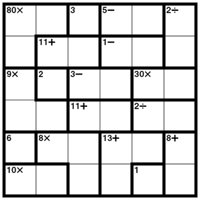

# calcudoku

This is a brute force based solution to calcudoku/kenken using Java. It takes user input from stdin line by line to form the board.  
Given a board with multiple solutions, the program will output only one of the solutions.  
Given a board with no solution, the program will output "no solution".  
Note that the program does not verify if the board is valid, so an invalid board has undefined behaviour.  

Example board:  

Example input (for the above board):  
>0 0 1 2 2 3  
0 4 4 5 5 3  
6 7 8 8 9 9  
6 6 10 10 11 11  
12 13 13 14 14 15  
16 16 13 14 17 15  
80* 3 5- 2/ 11+ 1- 9* 2 3- 30* 11+ 2/ 6 8* 13+ 8+ 10* 1  

Input explanation:  
Define the board line by line, with cages defined by their number. On the final line, define the operations for each cage in order, with a space in-between each operation.  

Expected output/solution:  
>5 4 3 1 6 2  
4 6 5 2 3 1  
3 2 1 4 5 6  
1 3 6 5 2 4  
6 1 2 3 4 5  
2 5 4 6 1 3  
